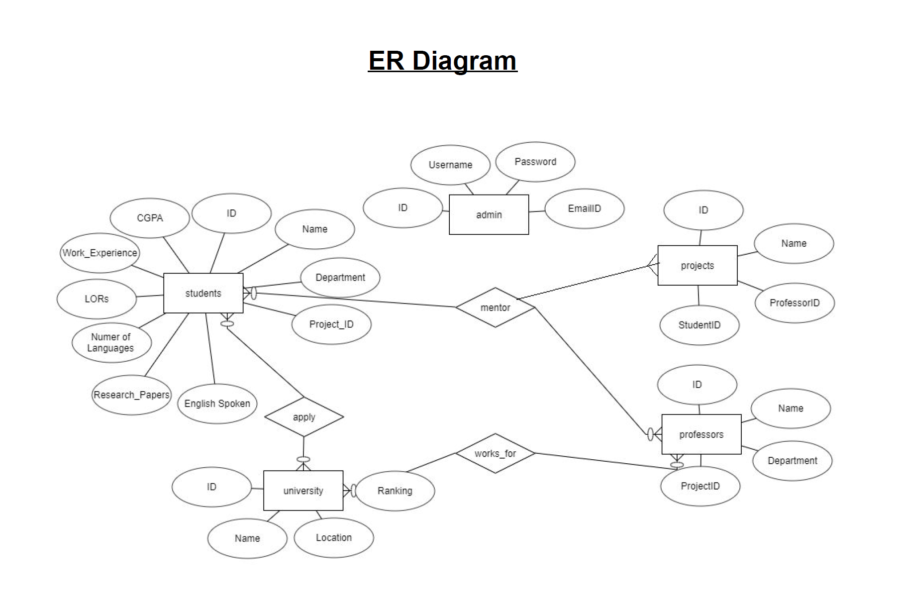
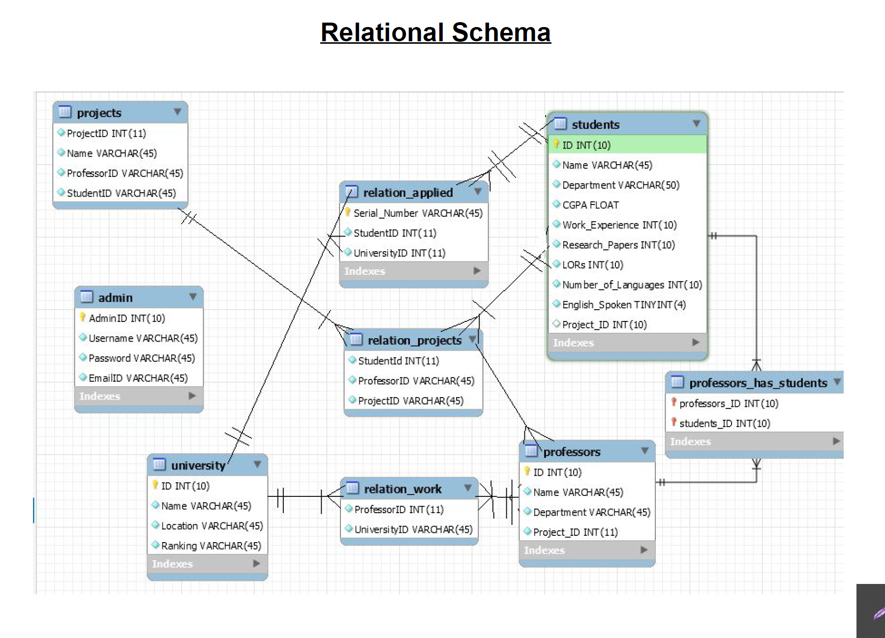

# Recruitment Application Shortlisting System

### Course Project for Fundamentals of Database Management Systems (CSE202) 
### Instructor : Dr. Vikram Goyal 
  
This repository is a Java based implementation of Applicant shortlisting system in order to find top contenders for recruitment/admission etc. based on criteria(could be academic record, experience etc.).
It involves various queries - both simple and complex in order to fetch the required information of candidates more efficiently and effectively. 

<b> Skills Used : </b>
Java, SQL, Scene-Builder for GUI

